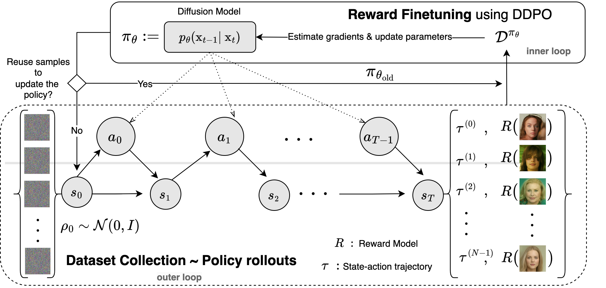
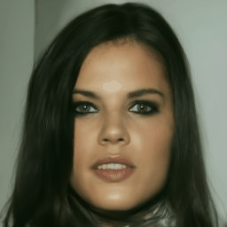
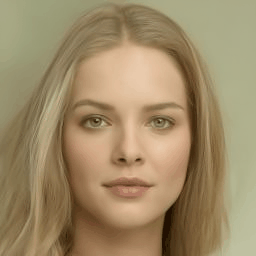
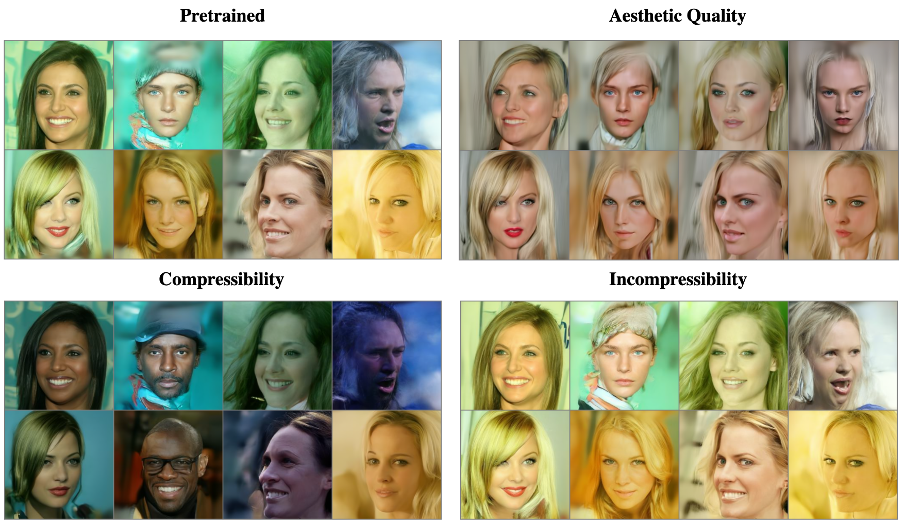
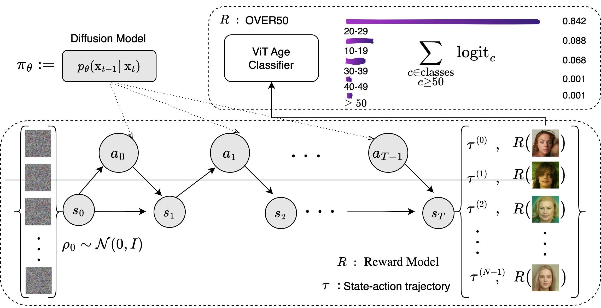
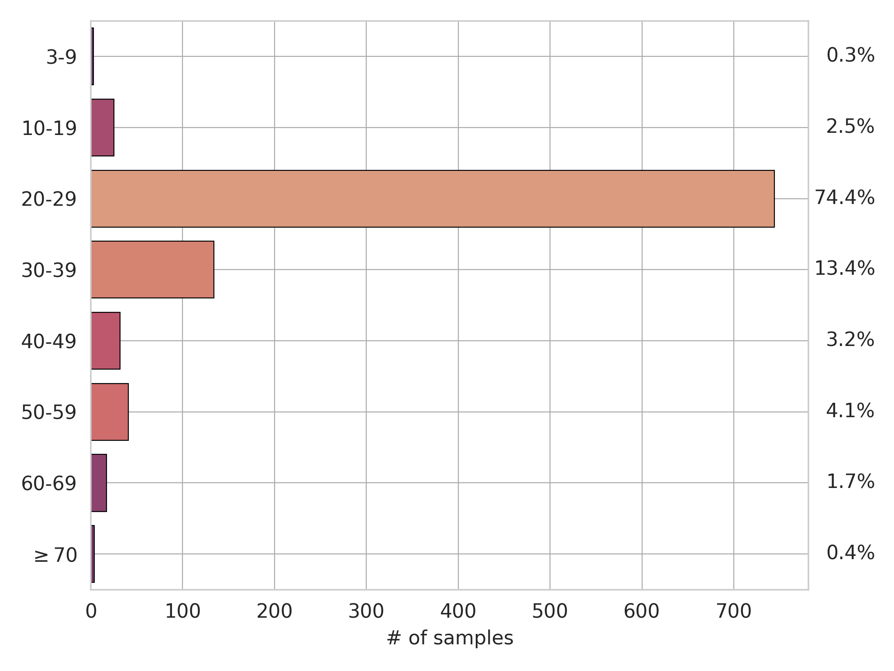
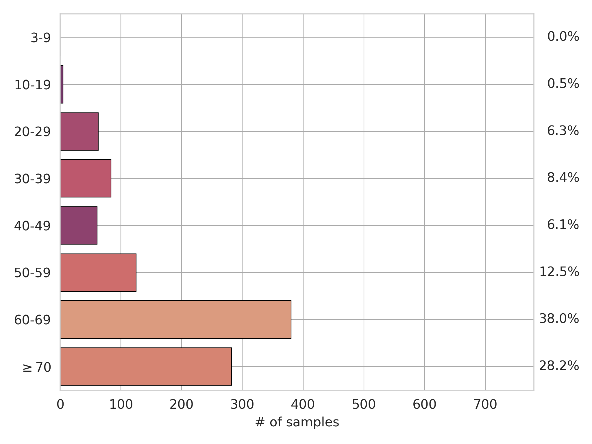
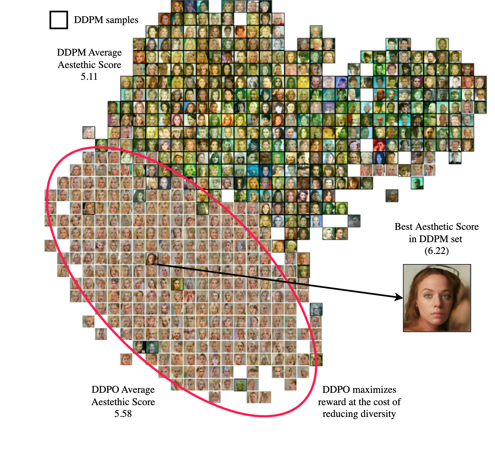

<h1 align="center">
  &nbsp; Finetuned Diffusion Models <br>using Reinforcement Learning<br>
  👾<br>
</h1>

Post-training experimentations on diffusion models using policy gradient methods. Explore ideas with
pretrained, non-conditional DDPM models. These models, such as <a href="https://huggingface.co/google/ddpm-celebahq-256" target="_blank">google/ddpm-celebahq-256</a> and <a href="https://huggingface.co/alkzar90/ddpo-aesthetic-church-256" target="_blank">google/ddpm-church-256</a>, are based on Denoising Diffusion Probabilistic Models <a href="https://arxiv.org/abs/2006.11239" target="_blank">(Ho et al., 2020)</a>.

<div style="display: flex; justify-content: center; align-items: center;">
  <figure style="text-align: center;">
    
    <figcaption style="font-size: 0.8em;"><b>Reward Finetuning is a two-step process to align a pre-trained diffusion  model (DDPM) with downstream tasks using reward-based optimization, known as DDPO <a href="https://arxiv.org/abs/2305.13301" target="_blank">(Black et al., 2023)</a></b>. In the first step, the diffusion model generates samples (trajectories), which are evaluated by a reward model acting as an oracle to determine which samples to incentivize. In the second step, gradients are estimated via Monte Carlo methods based on the collected dataset to update the diffusion model parameters.</figcaption>
  </figure>
</div>


## Downstream Tasks

This project support the three main downstream tasks use to align the image generation in the <a href="https://arxiv.org/abs/2305.13301" target="_blank"><i>Training Diffusion Models with Reinforcement Learning (Black et al. 2023)</i></a> work:


<table style="width: 100%; text-align: center;">
    <tr>
        <td style="text-align: center;">
            
            <br>
            <span style="display: block; text-align: center;">Aesthetic Quality</span>
        </td>
        <td style="text-align: center;">
            
            <br>
            <span style="display: block; text-align: center;">JPEG Compressibility</span>
        </td>
        <td style="text-align: center;">
            
            <br>
            <span style="display: block; text-align: center;">JPEG Incompressibility</span>
        </td>
    </tr>
</table>

A visual comparison between DDPM samples (i.e., pretrained) and DDPO samples generated from the same initial noise. The DDPO samples utilize checkpoints finetuned with their corresponding reward functions.

<div style="display: flex; justify-content: space-around; center;">
  <figure style="text-align: center;">
    
    <figcaption style="font-size: 0.8em;"><b>Visual comparison of DDPM and DDPO samples optimized for various downstream tasks.</b></figcaption>
  </figure>
</div>

### OVER50: Use an <i>off-the-shelf</i> classifier to design the reward function, 

- Roughly 6% of the samples generated by the <a href="https://huggingface.co/google/ddpm-celebahq-256" target="_blank">google/ddpm-celebahq-256</a> model are 50 ≥ years old
- Can we stress RL to generate more samples of this kind?
- <b>Goal:</b> Increasing the Frequency of Generated Celebrity-Like Faces Over 50 Years Old
- <a href="https://huggingface.co/nateraw/vit-age-classifier" target="_blank">ViT Age Classifier (Nate Raw, 2021)</a>, trained on the FairFace dataset, to predict the age of the samples.

<div style="display: flex; justify-content: center; align-items: center;">
  <figure style="text-align: center;">
    
  <figcaption style="font-size: 0.8em;"><b>Using a ViT Age Classifier to design the OVER50 reward.</b> The reward is computed as the sum of the logits for the relevant age classes, incentivizing samples wiith a hiigher likelihood of depiicting a faces over 50 years old.</figcaption>
  </figure>
</div>

```python
def over50_old(
    device: str = "cuda",
) -> Callable[[Any], torch.Tensor]:
    """Calculate the rewards for images with probabilities over 50 years old."""
    from transformers import ViTForImageClassification, ViTImageProcessor

    model = ViTForImageClassification.from_pretrained("nateraw/vit-age-classifier")
    transforms = ViTImageProcessor.from_pretrained("nateraw/vit-age-classifier")
    model.to(device)
    model.eval()

    def _fn(images):
        inputs = transforms(
            decode_tensor_to_np_img(
                images,
                melt_batch=False,
            ),
            return_tensors="pt",
        ).pixel_values.cuda()
        with torch.no_grad():
            outputs = model(inputs).logits
        return outputs[:, 6:].sum(dim=1)

    return _fn
```

<table style="width: 100%; text-align: center;">
    <tr>
        <td style="text-align: center;">
            
            <br>
            <span style="display: block; text-align: center;">DDPM age distribution<br>based on faces</span>
        </td>
        <td style="text-align: center;">
            
            <br>
            <span style="display: block; text-align: center;">Post-training distribution<br>with OVER50 </span>
        </td>
    </tr>
</table>


## Experiment Details 🧪

| Experiment         | Model (Hugging Face)                                                                                                                                  | W\&B                                                                                                                                                                                                                                                                                 |
|--------------------|-------------------------------------------------------------------------------------------------------------------------------------------------------|---------------------------------------------------------------------------------------------------------------------------------------------------------------------------------------------------------------------------------------------------------------------------------------|
| [**google/ddpm-celebahq-256**](https://huggingface.co/google/ddpm-celebahq-256) |                                                                                                                                               |                                                                                                                                                                                                                                                                                       |
| Aesthetic Quality   | [aesthetic-celebahq-256](https://huggingface.co/alkzar90/ddpo-aesthetic-celebahq-256)                                                                 | [run1](https://wandb.ai/alcazar90/ddpo-aesthetic-ddpm-celebahq256/runs/d5jb3r8a)/[run2](https://wandb.ai/alcazar90/ddpo-aesthetic-ddpm-celebahq256/runs/cfltp5ln)                                                                                                                      |
| Compressibility     | [compressibility-celebahq-256](https://huggingface.co/alkzar90/ddpo-compressibility-celebahq-256)                                                     | [run1](https://wandb.ai/alcazar90/ddpo-compressibility-ddpm-celebahq256/runs/eu71d08t)/[run2](https://wandb.ai/alcazar90/ddpo-compressibility-ddpm-celebahq256/runs/r2mxiasx)                                                                                                           |
| Incompressibility   | [incompressibility-celebahq-256](https://huggingface.co/alkzar90/ddpo-incompressibility-celebahq-256)                                                 | [run1](https://wandb.ai/alcazar90/ddpo-incompressibility-ddpm-celebahq256/runs/3gz13ov7)/[run2](https://wandb.ai/alcazar90/ddpo-incompressibility-ddpm-celebahq256/runs/b1srfre3)                                                                                                       |
| OVER50              | [over50-celebahq-256](https://huggingface.co/alkzar90/ddpo-over50-celebahq-256)                                                                       | [run1](https://wandb.ai/alcazar90/ddpo-over50-ddpm-celebahq256/runs/3x6sr17l)/[run2](https://wandb.ai/alcazar90/ddpo-over50-ddpm-celebahq256/runs/xfwb9vok)/[run3](https://wandb.ai/alcazar90/ddpo-over50-ddpm-celebahq256/runs/4422n639)/[run4](https://wandb.ai/alcazar90/ddpo-over50-ddpm-celebahq256/runs/dbmjb1s6)/[run5](https://wandb.ai/alcazar90/ddpo-over50-ddpm-celebahq256/runs/qfjzj6rd)/[run6](https://wandb.ai/alcazar90/ddpo-over50-ddpm-celebahq256/runs/b7wu16pl) |
| [**google/ddpm-church-256**](https://huggingface.co/google/ddpm-church-256) |                                                                                                                                               |                                                                                                                                                                                                                                                                                       |
| Aesthetic Quality   | [aesthetic-church-256](https://huggingface.co/alkzar90/ddpo-aesthetic-church-256)                                                                     | [run1](https://wandb.ai/alcazar90/ddpo-aesthetic-ddpm-church256/runs/5f69185v)/[run2](https://wandb.ai/alcazar90/ddpo-aesthetic-ddpm-church256/runs/4uqt5dwa)                                                                                                                           |
| Compressibility     | [compressibility-church-256](https://huggingface.co/alkzar90/ddpo-compressibility-church-256)                                                         | [run1](https://wandb.ai/alcazar90/ddpo-compressibility-ddpm-church256/runs/urd2hwd9)/[run2](https://wandb.ai/alcazar90/ddpo-compressibility-ddpm-church256/runs/7205y5cb)/[run3](https://wandb.ai/alcazar90/ddpo-compressibility-ddpm-church256/runs/82snqejo)                           |
| Incompressibility   | [incompressibility-church-256](https://huggingface.co/alkzar90/ddpo-incompressibility-church-256)                                                     | [run1](https://wandb.ai/alcazar90/ddpo-incompressibility-ddpm-church256/runs/jmbu5cgn)/[run2](https://wandb.ai/alcazar90/ddpo-incompressibility-ddpm-church256/runs/320xik9f)/[run3](https://wandb.ai/alcazar90/ddpo-incompressibility-ddpm-church256/runs/l0zqgs80)                       |

**Note:** Multiple runs indicate that the experiment continued training from the previous run, using the last saved checkpoint.

## Overoptimization and mode collapse


<div style="display: flex; justify-content: center; align-items: center;">
  <figure style="text-align: center;">
    
    <figcaption style="font-size: 0.8em;"><b>Comparison of Image Synthesis Using CelebA-HQ-Based Models.</b> 2D projection of CLIP embeddings for two sets of 1,000 samples: i) DDPM samples (black borders) and ii) DDPO samples fine-tuned with the LAION aesthetic reward (white borders). The DDPO samples were optimized to achieve a higher average aesthetic score (5.58 vs. 5.11), indicating better aesthetic quality. Notably, the DDPO samples cluster more tightly (red ellipse) around the highest-scoring DDPM sample, indicating a <i><b>mode collapse effect</b></i>. Both sets of samples were generated using the same seed.</figcaption>
  </figure>
</div>


## Getting Started

<p>
<a href="https://colab.research.google.com/drive/1zSaDb8tTG4jgMlWP2-V5ctX9qwzHzP9j?usp=sharing">
  
</a>
</p>

For setting the project.

```bash
git clone git@github.com:alcazar90/ddpo-celebahq.git
cd ddpo-celebahq
pip install -e .
```

Example for Running the training script:

```bash
python ./ddpo-celebahq/scripts/train.py \
--wandb_logging \
--task "aesthetic score" \
--initial_lr 0.00000009 \
--peak_lr 0.00000374 \
--warmup_pct 0.5 \
--num_samples_per_epoch 100 \
--batch_size 10 \
--num_epochs 25 \
--clip_advantages 10 \
--num_inner_epochs 1 \
--eval_every_each_epoch 1 \
--num_eval_samples 64 \
--run_seed 92013491249214123 \
--eval_rnd_seed 650  \
--save_model \
--ddpm_ckpt google/ddpm-church-256
```

For clone this repo, install dependencies, and running the training script in a Google Colab instance with GPU, follow [this colab as example](https://colab.research.google.com/drive/1b5L-6KoKVxrEmCX9K2wX_ETesCJdzpTm?usp=sharing).
